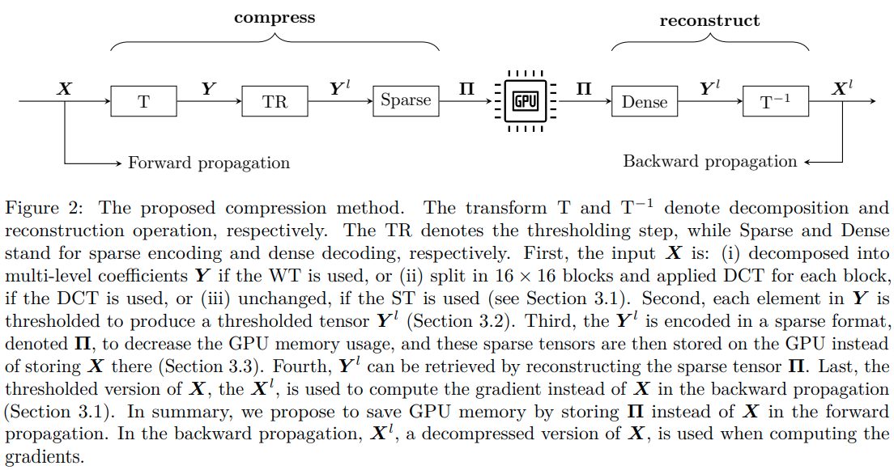
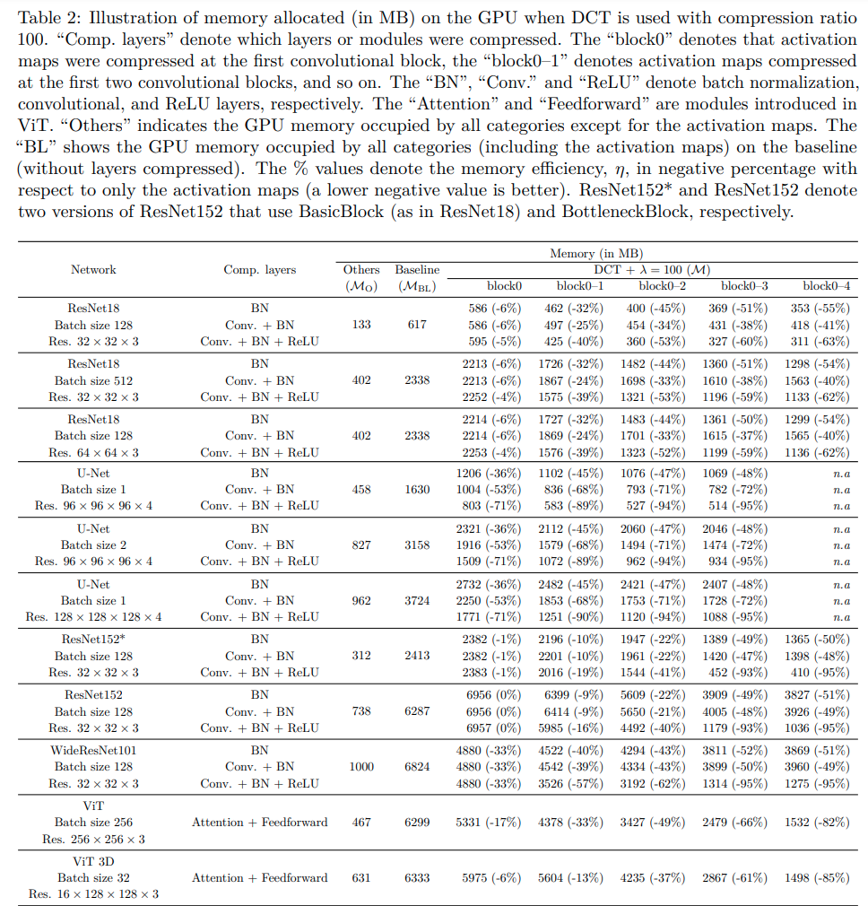
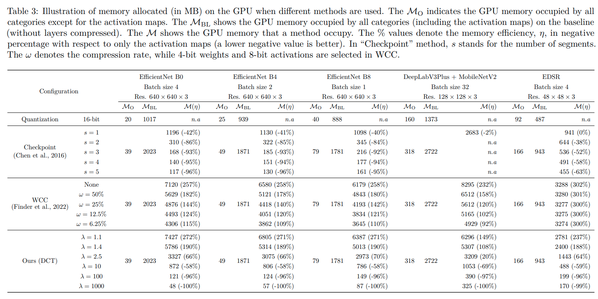

<!-- ## TO BE UPDATED -->

## Compressing the Activation Maps in Deep Neural Networks and Its Regularizing Effect

This repository contains the official PyTorch implementation of TMLR paper [Compressing the Activation Maps in Deep Neural Networks and Its Regularizing Effect](https://openreview.net/forum?id=s1qh12FReM).

Abstract: *Deep learning has dramatically improved performance in various image analysis applications in the last few years. However, recent deep learning architectures can be very large, with up to hundreds of layers and millions or even billions of model parameters that are impossible to fit into commodity graphics processing units. We propose a novel approach for compressing high-dimensional activation maps, the most memory-consuming part when training modern deep learning architectures. The proposed method can be used to compress the feature maps of a single layer, multiple layers, or the entire network according to specific needs. To this end, we also evaluated three different methods to compress the activation maps: Wavelet Transform, Discrete Cosine Transform, and Simple Thresholding. We performed experiments in two classification tasks for natural images and two semantic segmentation tasks for medical images. Using the proposed method, we could reduce the memory usage for activation maps by up to 95%. Additionally, we show that the proposed method induces a regularization effect that acts on the layer weight gradients.*




## Release notes


## Contributions

- We propose a novel way to compress the intermediate feature maps of a deep neural network (DNN). Our method stands out in its ability to handle any combination of layers within the model.
- We prove that the proposed method works as a regularizer that acts on the layer weight gradients and, by that, can help reduce overfitting.
- We demonstrate the utility of the proposed method by comparing the graphics processing unit (GPU) memory usage and performance of baseline models to that of models using the proposed compression method. The comparisons were made with respect to graphical memory use, training time, prediction time, and relevant model evaluation metrics. The experiments were performed on multiple datasets and network architectures.


## Installation

### Clone the repository

```bash
git clone https://github.com/vuhoangminh/Compressing-the-Activation-Maps-in-DNNs
```

### Install dependencies

```bash
cd Compressing-the-Activation-Maps-in-DNNs
source setup.sh
```

### Activate enviroment

```bash
conda activate compress
```


## Compression methods

We have provided several [compression methods](./engine/compression.py) as below:

 - NoCompression
 - RandomCompression
 - ThresholdingCompression
 - DCTCompression
 - WaveletTransformCompression

You can propose your own compression method as an example below. PyTorch provides an [API](https://pytorch.org/tutorials/intermediate/autograd_saved_tensors_hooks_tutorial.html) to control how saved tensors should be packed/unpacked.


```python
class RandomCompression(Compression):
    def __init__(self, net=None, compression_parameters=None):
        super(RandomCompression, self).__init__()
        self.net = net
        self.compression_parameters = compression_parameters

    def pack_hook(self, tensor):
        return tensor.size(), tensor.type()

    def unpack_hook(self, packed):
        s, t = packed
        return torch.rand(s).type(t).to("cuda")
```

See [PyTorch Wavelets](https://pywavelets.readthedocs.io/en/latest/ref/wavelets.html) for the list of available built-in wavelet families.


## Usage


### A simple example

Consider a simple network below:

```python
class Net(nn.Module):
    def __init__(self):
        super(Net, self).__init__()

        self.conv1 = nn.Conv2d(1, 16, 3, 1)
        self.conv2 = nn.Conv2d(16, 8, 3, 1)
        self.fc1 = nn.Linear(1152, 128)
        self.fc2 = nn.Linear(128, 10)
        self.dropout1 = nn.Dropout2d(0.25)
        self.dropout2 = nn.Dropout2d(0.5)
        self.relu = nn.ReLU()

    def forward(self, x):
        x = self.conv1(x)
        x = self.relu(x)
        x = self.conv2(x)
        x = F.max_pool2d(x, 2)
        x = self.dropout1(x)
        x = torch.flatten(x, 1)
        x = self.fc1(x)
        x = self.relu(x)
        x = self.dropout2(x)
        x = self.fc2(x)
        output = F.log_softmax(x, dim=1)
        return output
```

Assume we want to compress the activation maps of the first three layers using `RandomCompression` method:

```python
class CompressedNet(nn.Module):
    def __init__(self):
        super(Net, self).__init__(
            self, compression_method=RandomCompression, compression_parameters=None
        )

        self.conv1 = nn.Conv2d(1, 16, 3, 1)
        self.conv2 = nn.Conv2d(16, 8, 3, 1)
        self.fc1 = nn.Linear(1152, 128)
        self.fc2 = nn.Linear(128, 10)
        self.dropout1 = nn.Dropout2d(0.25)
        self.dropout2 = nn.Dropout2d(0.5)
        self.relu = nn.ReLU()

        self.compression = compression_method(self, compression_parameters)

    def forward(self, x):
        with torch.autograd.graph.saved_tensors_hooks(
            self.compression.pack_hook, self.compression.unpack_hook
        ):
            x = self.conv1(x)
            x = self.relu(x)
            x = self.conv2(x)

        x = F.max_pool2d(x, 2)
        x = self.dropout1(x)
        x = torch.flatten(x, 1)
        x = self.fc1(x)
        x = self.relu(x)
        x = self.dropout2(x)
        x = self.fc2(x)
        output = F.log_softmax(x, dim=1)
        return output
```

### Transformer module

```python
class Transformer(nn.Module):
    def __init__(
        self,
        dim,
        depth,
        heads,
        dim_head,
        mlp_dim,
        dropout=0.0,
    ):
        super().__init__()
        self.norm = nn.LayerNorm(dim)
        self.layers = nn.ModuleList([])
        for _ in range(depth):
            self.layers.append(
                nn.ModuleList(
                    [
                        Attention(dim, heads=heads, dim_head=dim_head, dropout=dropout),
                        FeedForward(dim, mlp_dim, dropout=dropout),
                    ]
                )
            )

    def forward(self, x):
        for attn, ff in self.layers:
            x = attn(x) + x
            x = ff(x) + x

        return self.norm(x)
```

If you want to compress all activation maps, do as follows: 

```python
class CompressedTransformer(nn.Module):
    def __init__(
        self,
        dim,
        depth,
        heads,
        dim_head,
        mlp_dim,
        dropout=0.0,
        compression_method=RandomCompression,
        compression_parameters=None,
    ):
        super().__init__()
        self.norm = nn.LayerNorm(dim)
        self.layers = nn.ModuleList([])

        self.compression_method = compression_method
        self.compression_parameters = compression_parameters
        self.compression = compression_method(self, compression_parameters)

        for _ in range(depth):
            self.layers.append(
                nn.ModuleList(
                    [
                        Attention(dim, heads=heads, dim_head=dim_head, dropout=dropout),
                        FeedForward(dim, mlp_dim, dropout=dropout),
                    ]
                )
            )

    def forward(self, x):
        for index, (attn, ff) in enumerate(self.layers):
            with torch.autograd.graph.saved_tensors_hooks(
                self.compression.pack_hook, self.compression.unpack_hook
            ):
                x = attn(x) + x
                x = ff(x) + x

        return self.norm(x)
```


See [models](./models) for more examples.


## Results





## Citation

```
@article{
	anonymous2023compressing,
	title={Compressing the Activation Maps in Deep Convolutional Neural Networks and Its Regularizing Effect},
	author={Anonymous},
	journal={Submitted to Transactions on Machine Learning Research},
	year={2023},
	url={https://openreview.net/forum?id=s1qh12FReM},
	note={Under review}
}
```

## Acknowledgements


## Contact for Issues

If you have any questions, don't hesitate to open an issue or reach out to me at: [minh.vu@umu.se](minh.vu@umu.se).


## License

This code is released under the MIT License.